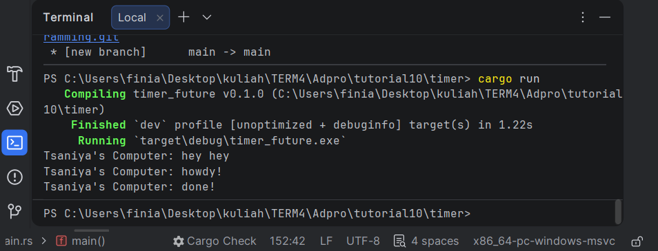

### Experiment 1.2: Understanding how it works

**Penjelasan mengapa output "hey hey" muncul terlebih dahulu:**
Hal ini terjadi karena pada baris kode `spawner.spawn(...)`, program sebenarnya hanya mendaftarkan/memasukkan fungsi `async` (yang berisi `howdy!` dan `done!`) ke dalam antrean (*queue*) untuk dieksekusi nanti.

Karena sifatnya *asynchronous*, *thread* utama (*main thread*) tidak menunggu antrean itu selesai, melainkan langsung lanjut mengeksekusi baris kode sinkronus yang ada di bawahnya, yaitu mencetak `"Tsaniya's Computer: hey hey"`.

Setelah itu, barulah program memanggil `executor.run()`. Fungsi inilah yang bertugas menjalankan tugas-tugas yang tadi sudah masuk ke dalam antrean. Oleh karena itu, `"howdy!"` dan `"done!"` baru dieksekusi dan dicetak belakangan.