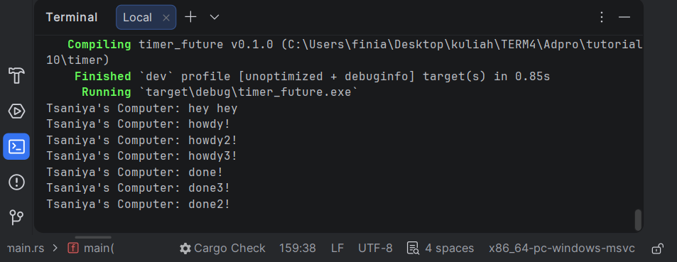
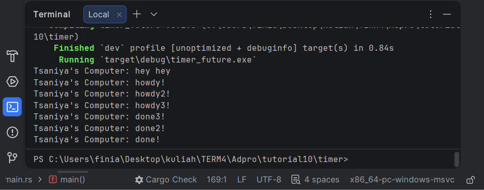
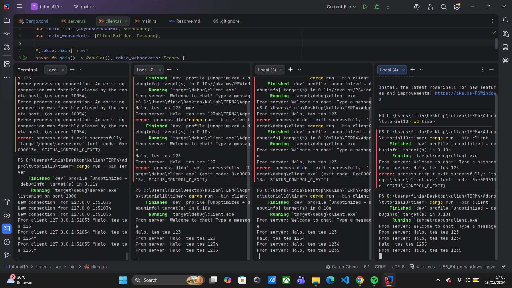

### Experiment 1.2: Understanding how it works

**Penjelasan mengapa output "hey hey" muncul terlebih dahulu:**
Hal ini terjadi karena pada baris kode `spawner.spawn(...)`, program sebenarnya hanya mendaftarkan/memasukkan fungsi `async` (yang berisi `howdy!` dan `done!`) ke dalam antrean (*queue*) untuk dieksekusi nanti.

Karena sifatnya *asynchronous*, *thread* utama (*main thread*) tidak menunggu antrean itu selesai, melainkan langsung lanjut mengeksekusi baris kode sinkronus yang ada di bawahnya, yaitu mencetak `"Tsaniya's Computer: hey hey"`.

Setelah itu, barulah program memanggil `executor.run()`. Fungsi inilah yang bertugas menjalankan tugas-tugas yang tadi sudah masuk ke dalam antrean. Oleh karena itu, `"howdy!"` dan `"done!"` baru dieksekusi dan dicetak belakangan.

---
### Experiment 1.3: Multiple Spawn and removing drop

**Penjelasan Multiple Spawn:**
Saat menambahkan beberapa `spawner.spawn`, program mencetak semua pesan "howdy" secara berurutan, melakukan *delay* 2 detik secara bersamaan, lalu mencetak semua pesan "done" . Hal ini menunjukkan bahwa tugas-tugas *async* tersebut dijalankan secara konkuren (bersamaan) oleh satu *thread* utama.

**Penjelasan mengapa fungsi `drop` penting:**
Fungsi `drop(spawner)` digunakan untuk menutup saluran (*channel*) komunikasi antara *spawner* (pengirim tugas) dan *executor* (penerima/pengeksekusi tugas).
Ketika baris `drop(spawner)` dihapus atau di- *comment*, *executor* tidak pernah menerima sinyal bahwa pengiriman tugas sudah selesai. Akibatnya, fungsi `executor.run()` akan terus berjalan tanpa henti (terblokir/nge-*hang*) karena selalu menunggu tugas baru yang tidak akan pernah datang dari *channel* tersebut .

---

### Experiment 2.1: Original code of broadcast chat

**How to run it and what happens:**
Untuk menjalankan aplikasi *chat* ini, saya membuka satu terminal untuk menjalankan server dengan perintah `cargo run --bin server`. Setelah server berjalan di port 2000, saya membuka tiga terminal lain untuk menjalankan client dengan perintah `cargo run --bin client`.
Ketika saya mengetikkan pesan di salah satu terminal client, pesan tersebut dikirim ke server, dan server langsung mem-*broadcast* (menyiarkan) pesan itu ke semua client lain yang terhubung. Hasilnya, pesan bisa diterima oleh terminal client lain secara *real-time*.

---

### Experiment 2.2: Modifying port

**Explanation & Code Changes:**
Untuk mengubah port aplikasi *chat* ini, saya perlu melakukan perubahan di dua sisi, yaitu *server* dan *client*, agar keduanya tetap bisa saling berkomunikasi di jalur yang sama.

1. **Di sisi Server (`src/bin/server.rs`):** Saya mengubah binding TCP Listener dari port 2000 menjadi 8080 pada baris `TcpListener::bind("127.0.0.1:8080").await?`.
2. **Di sisi Client (`src/bin/client.rs`):** Saya mengubah URI koneksi dari port 2000 menjadi 8080 pada baris `ClientBuilder::from_uri(Uri::from_static("ws://127.0.0.1:8080"))`.

**Is it also using the same websocket protocol? Where is it defined?**
Iya, program ini masih menggunakan protokol WebSocket yang sama. Protokol ini didefinisikan secara eksplisit di file **client** pada bagian URI: `"ws://127.0.0.1:8080"`. Skema `ws://` di depan IP address tersebut adalah penanda baku (*scheme*) bahwa koneksi yang diminta menggunakan protokol WebSocket (bukan HTTP biasa). Sedangkan di sisi **server**, penggunaan protokol WebSocket terjadi secara implisit ketika koneksi TCP stream biasa dibungkus (*wrapped*) dan di-*upgrade* menjadi WebSocket menggunakan pemanggilan fungsi `ServerBuilder::new().accept(socket)`.
