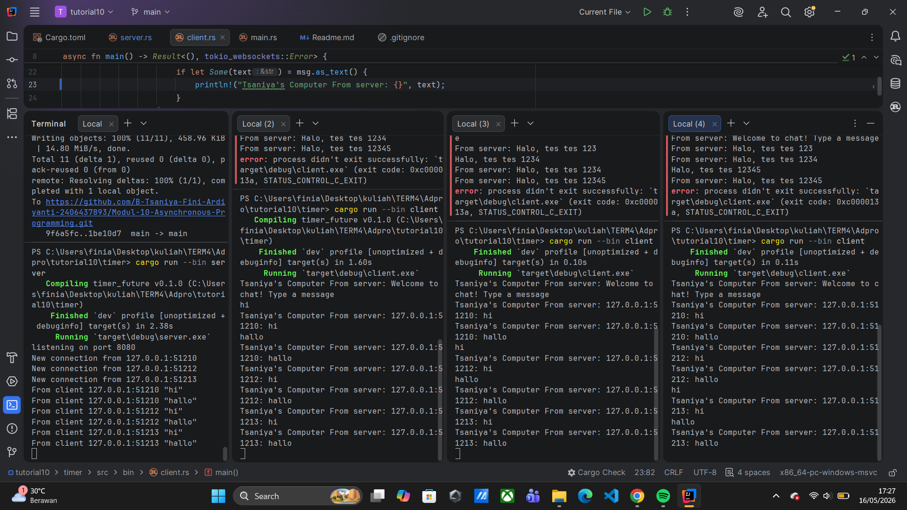
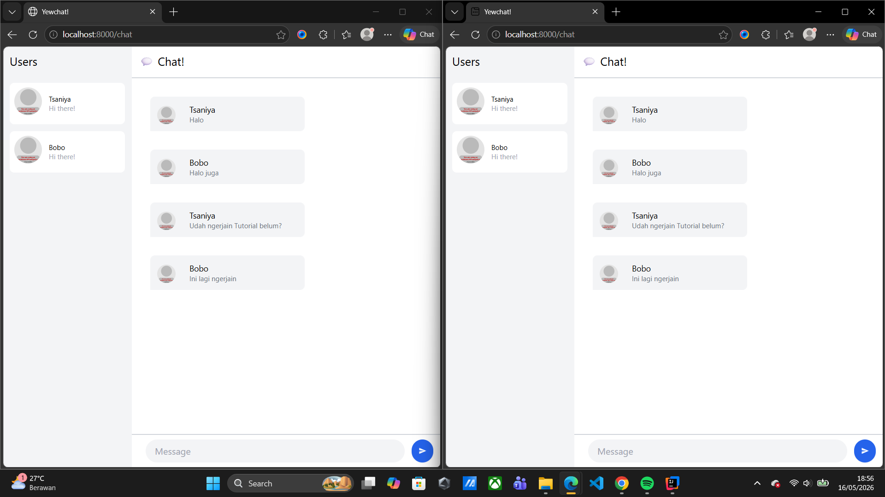
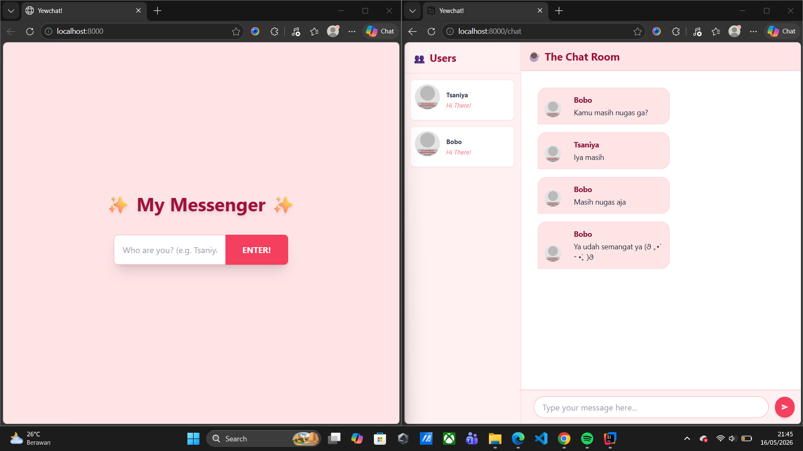
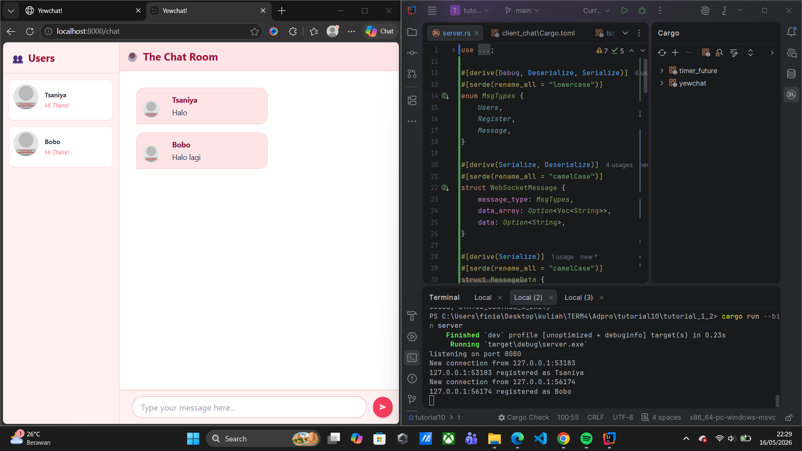

### Experiment 1.2: Understanding how it works

**Penjelasan mengapa output "hey hey" muncul terlebih dahulu:**
Hal ini terjadi karena pada baris kode `spawner.spawn(...)`, program sebenarnya hanya mendaftarkan/memasukkan fungsi `async` (yang berisi `howdy!` dan `done!`) ke dalam antrean (*queue*) untuk dieksekusi nanti.

Karena sifatnya *asynchronous*, *thread* utama (*main thread*) tidak menunggu antrean itu selesai, melainkan langsung lanjut mengeksekusi baris kode sinkronus yang ada di bawahnya, yaitu mencetak `"Tsaniya's Computer: hey hey"`.

Setelah itu, barulah program memanggil `executor.run()`. Fungsi inilah yang bertugas menjalankan tugas-tugas yang tadi sudah masuk ke dalam antrean. Oleh karena itu, `"howdy!"` dan `"done!"` baru dieksekusi dan dicetak belakangan.

---
### Experiment 1.3: Multiple Spawn and removing drop

**Penjelasan Multiple Spawn:**
Saat menambahkan beberapa `spawner.spawn`, program mencetak semua pesan "howdy" secara berurutan, melakukan *delay* 2 detik secara bersamaan, lalu mencetak semua pesan "done" . Hal ini menunjukkan bahwa tugas-tugas *async* tersebut dijalankan secara konkuren (bersamaan) oleh satu *thread* utama.

**Penjelasan mengapa fungsi `drop` penting:**
Fungsi `drop(spawner)` digunakan untuk menutup saluran (*channel*) komunikasi antara *spawner* (pengirim tugas) dan *executor* (penerima/pengeksekusi tugas).
Ketika baris `drop(spawner)` dihapus atau di- *comment*, *executor* tidak pernah menerima sinyal bahwa pengiriman tugas sudah selesai. Akibatnya, fungsi `executor.run()` akan terus berjalan tanpa henti (terblokir/nge-*hang*) karena selalu menunggu tugas baru yang tidak akan pernah datang dari *channel* tersebut .

---

### Experiment 2.1: Original code of broadcast chat

**How to run it and what happens:**
Untuk menjalankan aplikasi *chat* ini, saya membuka satu terminal untuk menjalankan server dengan perintah `cargo run --bin server`. Setelah server berjalan di port 2000, saya membuka tiga terminal lain untuk menjalankan client dengan perintah `cargo run --bin client`.
Ketika saya mengetikkan pesan di salah satu terminal client, pesan tersebut dikirim ke server, dan server langsung mem-*broadcast* (menyiarkan) pesan itu ke semua client lain yang terhubung. Hasilnya, pesan bisa diterima oleh terminal client lain secara *real-time*.

---

### Experiment 2.2: Modifying port

**Explanation & Code Changes:**
Untuk mengubah port aplikasi *chat* ini, saya perlu melakukan perubahan di dua sisi, yaitu *server* dan *client*, agar keduanya tetap bisa saling berkomunikasi di jalur yang sama.

1. **Di sisi Server (`src/bin/server.rs`):** Saya mengubah binding TCP Listener dari port 2000 menjadi 8080 pada baris `TcpListener::bind("127.0.0.1:8080").await?`.
2. **Di sisi Client (`src/bin/client.rs`):** Saya mengubah URI koneksi dari port 2000 menjadi 8080 pada baris `ClientBuilder::from_uri(Uri::from_static("ws://127.0.0.1:8080"))`.

**Is it also using the same websocket protocol? Where is it defined?**
Iya, program ini masih menggunakan protokol WebSocket yang sama. Protokol ini didefinisikan secara eksplisit di file **client** pada bagian URI: `"ws://127.0.0.1:8080"`. Skema `ws://` di depan IP address tersebut adalah penanda baku (*scheme*) bahwa koneksi yang diminta menggunakan protokol WebSocket (bukan HTTP biasa). Sedangkan di sisi **server**, penggunaan protokol WebSocket terjadi secara implisit ketika koneksi TCP stream biasa dibungkus (*wrapped*) dan di-*upgrade* menjadi WebSocket menggunakan pemanggilan fungsi `ServerBuilder::new().accept(socket)`.

---

### Experiment 2.3: Small changes, add IP and Port

**Explanation:**
Pada eksperimen ini, saya melakukan modifikasi kecil pada `server.rs` dan `client.rs` agar setiap pesan yang diterima oleh *client* menyertakan informasi IP dan Port pengirimnya.
Perubahan utamanya dilakukan di sisi server. Alih-alih hanya melakukan *broadcast* variabel `text` mentah, saya menggunakan makro `format!` untuk menggabungkan variabel `addr` (berisi IP dan Port pengirim) dengan pesan `text` menjadi `format!("{}: {}", addr, text)`. Saya melakukan modifikasi ini di sisi server agar pemrosesan/pemformatan string hanya dilakukan satu kali di pusat, sehingga semua *client* yang menerima *broadcast* sudah langsung mendapatkan format pesan yang utuh dan seragam tanpa perlu mengubah banyak logika di sisi *client*. Selain itu, pada file *client*, saya memodifikasi blok `println!` agar menambahkan identifier "Tsaniya's Computer" sesuai dengan contoh di modul.

---

### Experiment 3.1: Original code

**Explanation:**
Pada eksperimen ini, saya mengimplementasikan aplikasi WebChat menggunakan *framework* Yew untuk sisi *client* dan Node.js untuk sisi WebSocket *server*. Setelah mengkloning repositori *server* dan menjalankannya dengan `npm start`, saya mengkloning repositori *client*. Saya kemudian menyesuaikan versi `wasm-bindgen` agar kompatibel dengan versi Rust saat ini dan menjalankannya menggunakan `npm start` (yang otomatis memanggil `wasm-pack` dan `webpack`).
Saat saya membuka beberapa *tab browser* secara bersamaan (mensimulasikan *multiple clients*), antarmuka WebChat berhasil dirender. Pesan yang dikirimkan dari satu *tab* berhasil diteruskan ke server dan di-*broadcast* kembali sehingga muncul di *tab* lainnya secara *real-time*. Ini membuktikan bahwa arsitektur *event-driven* dapat diterapkan untuk membangun sistem *chat* interaktif di ekosistem web dengan WebAssembly.

---

### Experiment 3.2: Be Creative!

**Explanation:**

Modifikasi yang saya lakukan meliputi:

1. **Perubahan Tema Warna:** Mengganti skema warna bawaan menjadi tema bernuansa *rose/pink* (menggunakan *class* seperti `bg-rose-100`, `bg-rose-50`, dan `text-rose-800`).
2. **Halaman Login:** Menambahkan judul utama "✨ My Messenger ✨" dan mengubah *placeholder* input menjadi lebih interaktif ("Who are you? (e.g. Tsaniya)"). Tombol *submit* juga dimodifikasi dengan warna `bg-rose-500` dan efek transisi saat di-*hover*.
3. **Halaman Chat:** Memperbarui *header* ruang obrolan menjadi "☕ The Chat Room", serta membuat *bubble chat* terlihat lebih modern dengan lengkungan (`rounded-2xl`) dan bayangan (`shadow-sm`).

---

### Bonus: Rust Websocket server for YewChat!

**Explanation of How I Did It:**

Untuk membuat server Rust dari Tutorial 2 kompatibel dengan client Yew dari Tutorial 3, server perlu menangani string berformat JSON daripada plain text.

1. Saya menambahkan `serde` dan `serde_json` ke `Cargo.toml` untuk melakukan serialisasi dan deserialisasi pesan.
2. Saya mendefinisikan struct/enum `WebSocketMessage`, `MessageData`, dan `MsgTypes` di Rust untuk mencerminkan struktur JSON yang diharapkan oleh client Yew.
3. Saya mengimplementasikan pelacakan state pengguna yang thread-safe menggunakan `Arc<Mutex<HashMap<SocketAddr, String>>>`. Ketika client mengirim pesan `Register`, server menyimpan username mereka dan mem-broadcast pesan `Users` yang berisi daftar pengguna aktif yang telah diperbarui.
4. Ketika server menerima tipe `Message`, server melampirkan username pengirim dari state, melakukan serialisasi kembali ke JSON, dan mem-broadcast-nya ke semua client yang terhubung.

**Why It Is a Successful Change:**

Perubahan ini berhasil karena protokol WebSocket bersifat language-agnostic. Protokol ini hanya mengirimkan data (dalam hal ini, string teks mentah). Selama server Rust dapat mengurai string JSON yang masuk dan mengirim kembali string JSON yang terstruktur dengan benar sesuai ekspektasi client Yew WebAssembly, keduanya dapat berkomunikasi dengan sempurna. Client Yew tidak mengetahui atau peduli apakah backend ditulis dalam JavaScript/Node.js atau Rust/Tokio.

**My Opinion: JavaScript vs. Rust Version**

- **JavaScript (Node.js):** Menurut saya versi JS jauh lebih cepat untuk prototyping. Karena JSON bersifat native di JavaScript, kita tidak perlu mendefinisikan struct yang ketat atau menggunakan crate pihak ketiga untuk mengurai pesan. Sangat mudah dan langsung.
- **Rust (Tokio):** Saya lebih menyukai versi Rust untuk produksi dan skalabilitas. Meskipun pengaturan awalnya lebih kompleks (memerlukan `serde` dan definisi tipe yang ketat), strong typing milik Rust mencegah runtime error. Selain itu, memory safety Rust dan model asinkron Tokio membuatnya jauh lebih efisien dan aman ketika menangani ribuan koneksi WebSocket secara bersamaan dibandingkan Node.js.